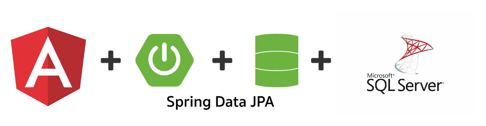

# Control de Vacunación COVID-19
## Realizado por Marvin José Calderón - 03 de abril del 2022

<!-- PROJECT LOGO -->
<br />
<div align="center">
  <a href="">
    
  </a>
  <h3 align="center">Prueba Técnica - Control de Vacunación COVID-19</h3>
  <p align="center">
    Empresa: CentraRecursos
  </p>
</div>

<!-- ABOUT THE PROJECT -->
## Acerca del proyecto

El proyecto consiste en realizar un pequeño proyecto para llevar el control y seguimiento de la vacunación de los empleados de una empresa. **No** se requiere sistema de sesiones o control de accesos, puede ser un plus, pero no es necesario.

### Arquitectura de la aplicación

<div align="center">
  <a href="">
    
  </a>
</div>

La arquitectura de la aplicación fue creada de la siguiente manera:

* La capa de base de datos está siendo gestionada por SQL Server 2019 a través de una imagen de Docker.
* La capa de backend está siendo gestionada por Spring haciendo uso de JPA (Java Persistent API) para la interacción con la base de datos.
* La capa de frontend está siendo gestionada por Angular en su versión 13 acompañado de Bootstrap para la definición de estilos.


<!-- GETTING STARTED -->
## Empezando

### Pre-requisitos

La forma correcta de levantar el entorno de la aplicación dependerá unicamente de una buena conexión a internet y de contar con las herramientas:

* Angular CLI v13
* Docker Engine
* Docker Compose

### Instalación

1. Clona este repositorio
```sh
  git clone --recurse-submodules https://github.com/mcalderon7/ControlDeVacunacion.git
```

2. Una vez clonado, se debe proceder a descomprimir el archivo _back-end/src/main/resources/backend-jar.tar.xz_ que contiene el JAR que se encarga de levantar los servicios en JAVA.  **Únicamente hay que descomprimirlo y dejar el JAR en la misma ruta con el mismo nombre.**  En Linux, para descomprimirlo, sería con el siguiente comando:

```sh
  tar -xf backend-jar.tar.xz
```

3. Usando la herramienta de Angular CLI, se utilizará el siguiente comando para compilar los archivos de Typescript:

```sh
  cd /front-end
  ng build
```
4. Una vez esta construida la para del front-end, regresamos a la raiz y ejecutamos el siguiente comando de docker-compose:
```sh
  docker-compose -f "docker-compose.yml" up -d --build
```
5. El último paso sería esperar 1 minuto aproximadamente en lo que se levantan los servicios y verificar que todos hayan sido ejecutados correctamente.